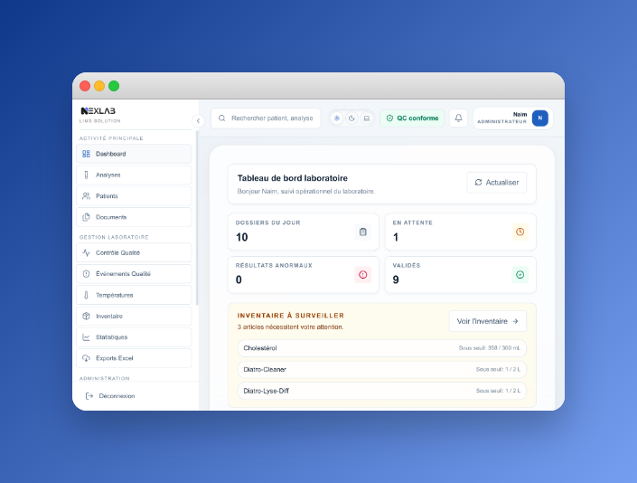

# NexLab LIMS

> **Système de Gestion de Laboratoire d'Analyses Médicales**  
> Laboratory Information Management System for medical laboratories



**NexLab** is a complete, production-ready LIMS built for medical biology laboratories — from small independent labs to hospital-based CSSB units. It covers the full analysis lifecycle: patient registration, result entry, technical and biological validation, professional report printing, quality control, inventory, and operations monitoring.

---

## ❤️ Why I Built This

As a medical laboratory technologist, I spent years manually writing patient results, managing paper records, and worrying about transcription errors. Existing LIMS solutions were either prohibitively expensive, too complex to deploy, or simply not adapted to the realities of a small Tunisian public lab.

I built NexLab because I know exactly what a lab needs — because I work in one every day.

---

## ✨ Features

### 🧪 Analysis Workflow
- Fast patient registration and order creation
- Full analysis lifecycle: **Pending → In Progress → Validated (Tech) → Validated (Bio)**
- Role-based access control: Admin, Technician, Biologist (Doctor), Receptionist
- Keyboard-optimized result entry with **Enter-to-next-field** navigation
- Automatic flagging of abnormal values (↑ ↓) against configurable reference ranges
- **Delta check**: previous results shown inline during entry for trend detection
- Urgent specimen tracking with TAT (Turn-Around Time) monitoring

### 🔬 Clinical Calculations
- **Hematology indices**: VGM (MCV), TCMH (MCH), CCMH (MCHC) — auto-calculated
- **CBC discrimination indices** (displayed on printed report):
  - Microcytosis: Mentzer, RDWI, Green & King
  - Inflammation: NLR, PLR, MLR, SII
- **eGFR estimation**:
  - CKD-EPI 2021 (race-free) for adults ≥ 18 years
  - EKFC 2021 for children aged 2–17 years
  - Automatic formula routing based on patient age
- **Custom formula engine**: define calculated tests (BUN/CR ratio, etc.) with arithmetic expressions in the test catalog

### 📄 Professional Reporting
- High-quality A4 printed reports with lab branding (logo, stamp, signature)
- Multi-category, multi-page layout with repeating headers
- Previous results column for longitudinal comparison
- CBC indices page with clinical interpretation
- Analyzer histogram page (WBC, RBC, PLT distribution curves)
- Printable patient envelopes (pochettes)
- Barcode integration on reports

### 📊 Quality Control (QC)
- Levey-Jennings control charts per analyte
- QC material and lot management
- Target value and standard deviation configuration
- Daily QC status summary on dashboard
- QC compliance check enforced before technical validation

### 📦 Inventory Management
- Reagent and consumable stock tracking
- Lot management with expiry date monitoring
- Automatic low-stock and expiry alerts
- Movement history and reorder rules
- Analytics dashboard

### 🌡️ Temperature Monitoring
- Multi-instrument temperature logging (fridges, analyzers, incubators)
- Out-of-range alerts
- Monthly temperature reports

### 📋 Operations
- **Dashboard**: daily KPIs, active analyses, QC status, inventory alerts, temperature alerts, backup staleness — all at a glance
- **TAT tracking**: configurable warn/alert thresholds with per-analysis display
- **Audit trail**: full action log with configurable retention
- **CNAM export**: Caisse Nationale d'Assurance Maladie compatible data export
- **Statistics & Excel export**: analysis throughput, revenue, test frequency
- **Diatron analyzer import**: direct result import from compatible CBC analyzers

### 🛡️ Data Safety
- **Recovery bundles**: one-click creation of signed `.tar.gz` archives (database + uploads + docker-compose), with SHA-256 integrity verification and atomic restore with automatic rollback
- **Scheduled backups**: automated backup rotation with configurable retention
- **Database integrity checks** at startup and on-demand
- **Migration safety**: schema migration with rollback capability
- Persistent named Docker volumes — data survives container updates

---

## 🚀 Quick Install (Recommended)

The easiest way to deploy NexLab is using the **offline installer package** — no internet connection required on the target machine.

### Prerequisites
- Docker Desktop (Windows/macOS) or Docker Engine (Linux)
- 1 GB free disk space

### Linux / macOS
```bash
# Extract the installer package, then:
bash install.sh
```

### Windows
```powershell
# Right-click install.ps1 → Run with PowerShell
.\install.ps1
```

The installer will:
1. Load the pre-built Docker image
2. Create persistent data volumes
3. Configure and start the application
4. Open NexLab at **http://localhost** (port 80)

On first launch, navigate to `/setup` to initialize the database and create the admin account.

---

## 🛠 Developer Setup

### Prerequisites
- Node.js 20+
- Bun (recommended) or npm

### Steps

```bash
# 1. Clone the repository
git clone https://github.com/NaimZaaraoui/NexLab.git
cd nexlab

# 2. Install dependencies
bun install

# 3. Set up environment
cp .env.example .env
# Edit .env: set AUTH_SECRET to a random string

# 4. Initialize the database
bunx prisma migrate deploy
bunx prisma generate

# 5. Start the development server
bun dev
```

Open [http://localhost:3000](http://localhost:3000) and go to `/setup` to initialize.

---

## 🐳 Docker Compose (Self-hosted)

```bash
# Copy and configure environment
cp .env.example .env
# Edit .env: AUTH_SECRET, NEXTAUTH_URL

# Build and start
docker compose up -d
```

> [!IMPORTANT]
> Database and uploads are stored in named Docker volumes (`nexlab-db`).
> Your data persists across container restarts and updates.
> Use the built-in recovery bundle feature for off-site backups.

---

## 🏗 Project Structure

```
├── app/
│   ├── (app)/              # Main application pages
│   │   ├── analyses/       # Analysis list and detail pages
│   │   ├── dashboard/      # Dashboard + admin modules
│   │   └── page.tsx        # Main dashboard
│   ├── (print)/            # Isolated print layouts
│   └── api/                # 29 REST API endpoints
├── components/
│   ├── analyses/           # 39 analysis workflow components + hooks
│   ├── print/              # Report, envelope, QC print templates
│   ├── qc/                 # Quality control UI
│   ├── inventory/          # Inventory management UI
│   └── ui/                 # Generic design system components
├── lib/
│   ├── calculations.ts     # All clinical calculations (eGFR, CBC indices, hematology)
│   ├── calculated-tests.ts # RPN formula engine for custom tests
│   ├── status-flow.ts      # Analysis lifecycle state machine
│   ├── recovery-bundles.ts # Backup and restore system
│   └── ...                 # 50+ utility modules
├── tests/
│   ├── e2e/                # Playwright end-to-end test suites
│   └── unit/               # Vitest unit tests
├── nexlab-install/         # Offline installer package (Linux + Windows)
├── scripts/                # Maintenance scripts (backups, demo DB, etc.)
├── docker-compose.yml
└── Dockerfile
```

---

## 🔧 Tech Stack

| Layer | Technology |
|---|---|
| Framework | Next.js 16.1 (App Router) |
| Language | TypeScript 5 (strict) |
| Database | SQLite via Prisma ORM 7 |
| Styling | Tailwind CSS 4 |
| Charts | Recharts |
| Icons | Lucide React |
| Auth | NextAuth.js v5 |
| Testing | Vitest + Playwright |
| Deployment | Docker + Docker Compose |

---

## 📜 License

**NexLab LIMS is proprietary software.**

The source code in this repository is made available for **transparency and evaluation purposes only**. You may not copy, redistribute, sublicense, or deploy NexLab commercially without a valid licence key issued by the author.

Commercial deployment requires a per-installation licence. Each licence is cryptographically bound to the target machine (Machine ID).

For licensing inquiries: **contact the author directly.**

---

## 🔑 Commercial Licensing

NexLab uses an offline, machine-bound licensing system.

- After installation, each instance receives a unique **Machine ID** (visible in Settings → Licence).
- A licence key (JWT) is issued by the author, tied to that Machine ID and a validity period.
- Without a valid licence, the application enters **read-only mode** — existing data is accessible but new analyses cannot be created.
- Licences are available for trial (30 days), annual, and lifetime durations.

To request a licence or discuss pricing, open an issue or reach out via LinkedIn.

---

*NexLab — Precision and Care in Every Result.*
